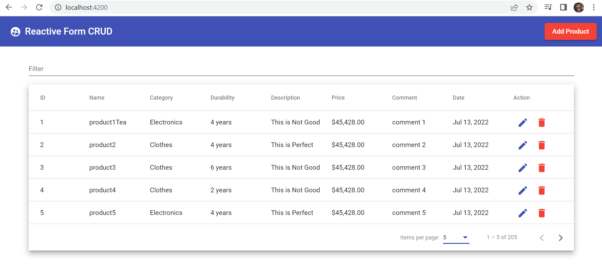
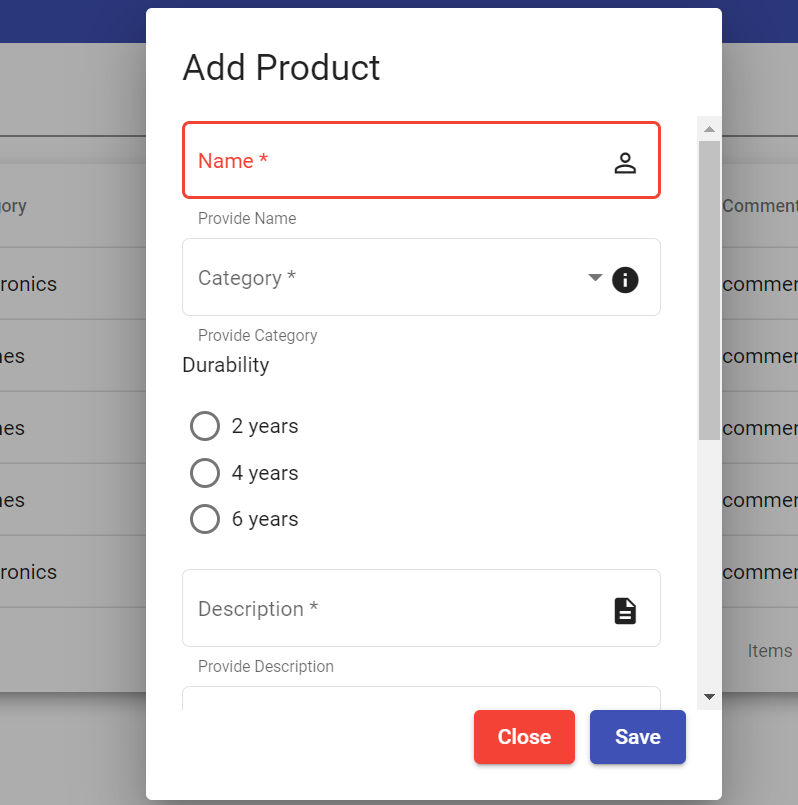

# FullStack_RactiveForm_Pagination_Table
The Project is Pagination in Springboot and Reactive Forms in Angular and Table in Material Design

### Backend : Use of Swagger 3.0

To Access Swagger URL : localhost:8080/swagger-ui.html

For Adding Dummy records a method is added to put 200 records in the db.
Pagination and Sorting in implemented using Backend as well as Front-end but we are using Frontend Not the backend services in the project.

Front End
Angular Materila Icons Names website : https://www.angularjswiki.com/angular/angular-material-icons-list-mat-icon-list/

## Project Look and Feel

### Main Screen

### Reactive Form
Form with Material Design controls

